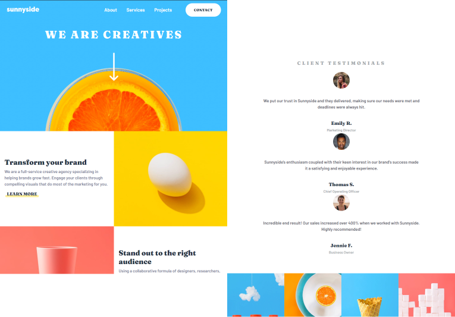

# Frontend Mentor - Sunnyside agency landing page solution

This is a solution to the [Sunnyside agency landing page challenge on Frontend Mentor](https://www.frontendmentor.io/challenges/sunnyside-agency-landing-page-7yVs3B6ef). Frontend Mentor challenges help you improve your coding skills by building realistic projects.

## Table of contents

- [Overview](#overview)
  - [The challenge](#the-challenge)
  - [Screenshot](#screenshot)
  - [Links](#links)
- [My process](#my-process)
  - [Built with](#built-with)
  - [Useful resources](#useful-resources)
- [Author](#author)

## Overview

### The challenge

Users should be able to:

- View the optimal layout for the site depending on their device's screen size
- See hover states for all interactive elements on the page

### Screenshot

### Links

<!-- TODO: Add live site URL -->

- Live Site URL: [Sunnyside](https://your-live-site-url.com)

## My process

### Built with

- Semantic HTML5 markup
- Mobile-first workflow
- [React](https://reactjs.org/) - JS library
- [Next.js](https://nextjs.org/) - React framework
- [MUI](https://mui.com/) - For styles
- [Strapi](https://strapi.io/) - Headless CMS

### Useful resources

- [Adjust div height to background image size](https://stackoverflow.com/questions/600743/how-to-get-div-height-to-auto-adjust-to-background-size)
- [What is Open Graph and how can I use it for my website?](https://www.freecodecamp.org/news/what-is-open-graph-and-how-can-i-use-it-for-my-website/) - This article helped me to understand open graphs and how to utilize them to improve a website's SEO.
- [CSS clip-path maker](https://bennettfeely.com/clippy/) - This online tool helped to add the triangle shape to the mobile menu corner

## Author

- Frontend Mentor - [@hamilton-i7](https://www.frontendmentor.io/profile/hamilton-i7)
- Twitter - [@hamilton_i7](https://twitter.com/hamilton_i7)
